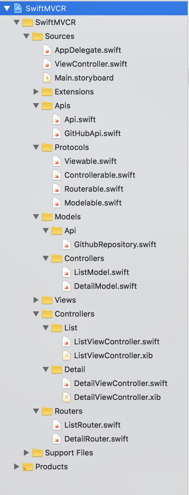
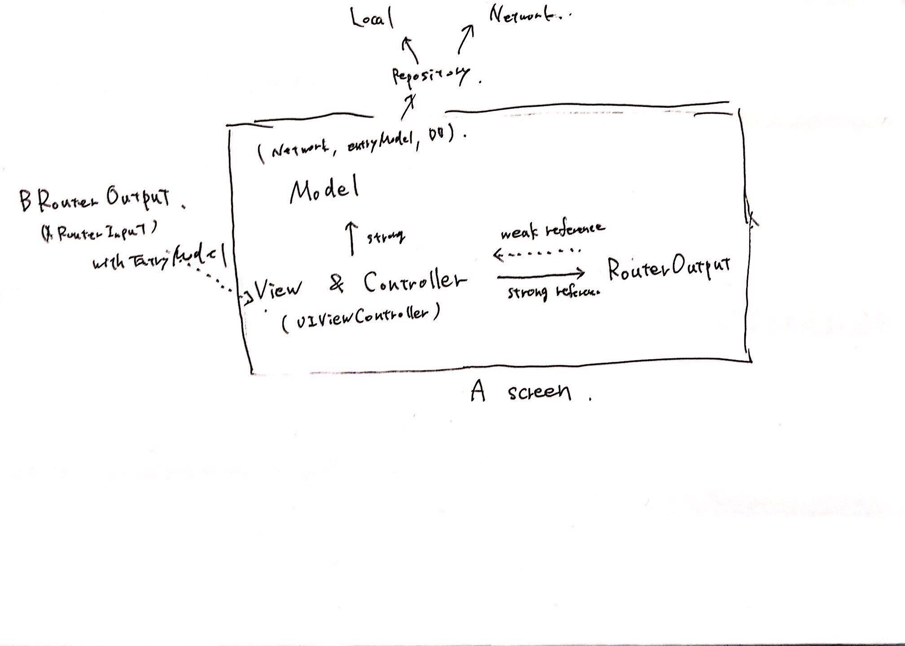

# SwiftMVCR (Model, View, Controller, Router)

SwiftMVCR is an sample iOS App written in Swift using the MVCR architecture.  (Model, View, Controller, Router)

[](https://swift.org)

## Sample App




**Architecture**  



## Description

MVCR means Model, View, Controller, Router.   
You can easy to know transitions of app. But, Not testable Architecture

### Model
Model must implement Modelable.
```swift
protocol Modelable {
    // nop
}
```

Example

```swift

final class Model: Modelable {
    ...
}

```


### View (including UIViewController)
View must implement Viewable. Viewable has Default Extension.  
※ View of this case is not just View like UIView etc.

```swift

protocol Viewable: AnyObject {
    func push(_ vc: UIViewController, animated: Bool)
    func present(_ vc: UIViewController, animated: Bool)
    func pop(animated: Bool)
    func dismiss(animated: Bool)
    func dismiss(animated: Bool, completion: @escaping (() -> Void))
}

extension Viewable where Self: UIViewController {

    func push(_ vc: UIViewController, animated: Bool) {
        self.navigationController?.pushViewController(vc, animated: animated)
    }

    func present(_ vc: UIViewController, animated: Bool) {
        self.present(vc, animated: animated, completion: nil)
    }

    func pop(animated: Bool) {
        self.navigationController?.popViewController(animated: animated)
    }

    func dismiss(animated: Bool) {
        self.dismiss(animated: animated, completion: nil)
    }

    func dismiss(animated: Bool, completion: @escaping (() -> Void)) {
        self.dismiss(animated: animated, completion: completion)
    }
}


```

Example

```swift

extension ViewController: Viewable {}

```

### Controller (including UIViewController)
Controller must implement Controllerable.


```swift
protocol Controllerable {
    associatedtype M: Modelable
    associatedtype R: Routerable
    var model: M! { get }
    var router: R! { get }
}
```

Example

```swift

final class ViewController: UIViewController, Controllerable {
    
    ...
    
    static func configure(entryModel: EntryModel) -> ViewController {
        let controller = ViewController()
        controller.router = RouterOutput(controller)
        controller.entryModel = entryModel
        return controller
    }
    private(set) var model: ListModel!
    private(set) var router: RouterOutput!
    
    
    override func viewDidLoad() {
        super.viewDidLoad()
    }
    
    ...
}
```

**UIViewController has roles that View and Controller. But,  its ok.**


### Router
Router must implement Routerable.


```swift
protocol Routerable {
    var view: Viewable! { get }

    func dismiss(animated: Bool)
    func dismiss(animated: Bool, completion: @escaping (() -> Void))
    func pop(animated: Bool)
}

extension Routerable {
    func dismiss(animated: Bool) {
        view.dismiss(animated: animated)
    }

    func dismiss(animated: Bool, completion: @escaping (() -> Void)) {
        view.dismiss(animated: animated, _completion: completion)
    }

    func pop(animated: Bool) {
        view.pop(animated: animated)
    }
}

```

Example

```swift


struct EntryModel {}

final class RouterInput {
    func push(from: Viewable, entryModel: EntryModel) {
        let controller = ViewController.configure(entryModel: entryModel)
        from.push(controller, animated: true)
    }

    func present(from: Viewable, entryModel: EntryModel) {
        let controller = ViewController.configure(entryModel: entryModel)
        from.present(controller, animated: true)
    }
}

final class RouterOutput: Routerable {

    weak private(set) var view: Viewable!

    init(_ view: Viewable) {
        self.view = view
    }

    func transitionToOther(entryModel: EntryModel) {
        OtherRouterInput().push(from: view, entryModel: entryModel)
    }
}
```

### Unit Test 

WIP ... 


## Requirements

- iOS 10.0+
- Xcode 10.0+
- Swift 4.2+

## Installation

```
git clone git@github.com:yokurin/SwiftMVCR.git
```

## Author

Tsubasa Hayashi, yoku.rin.99@gmail.com

## License

SwiftMVCR is available under the MIT license. See the LICENSE file for more info.
